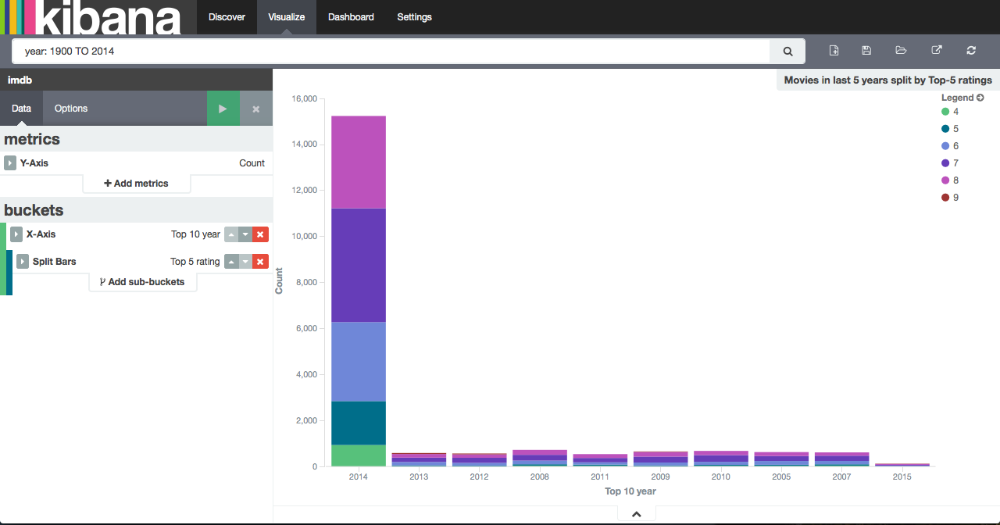
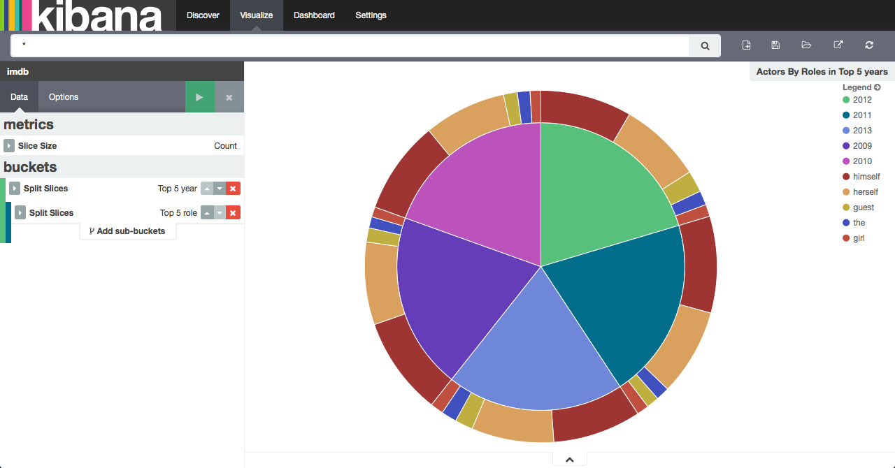
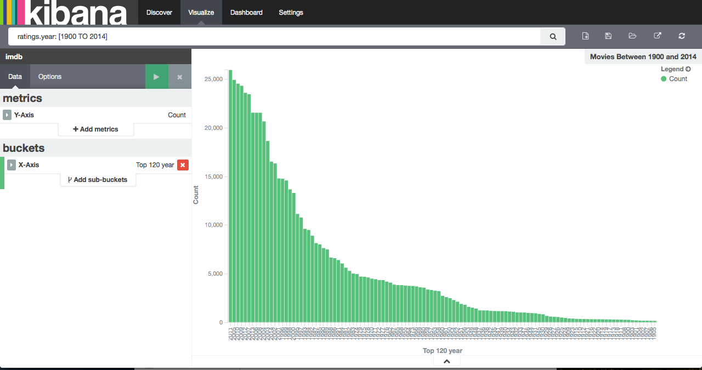
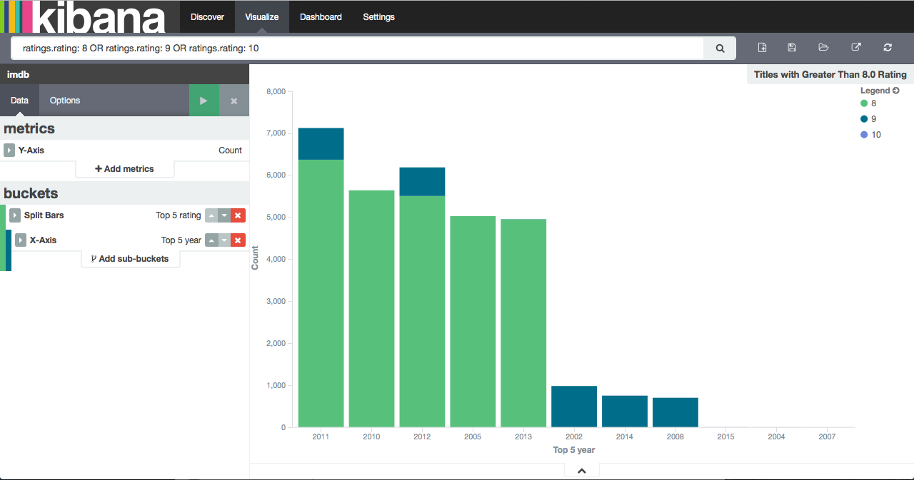
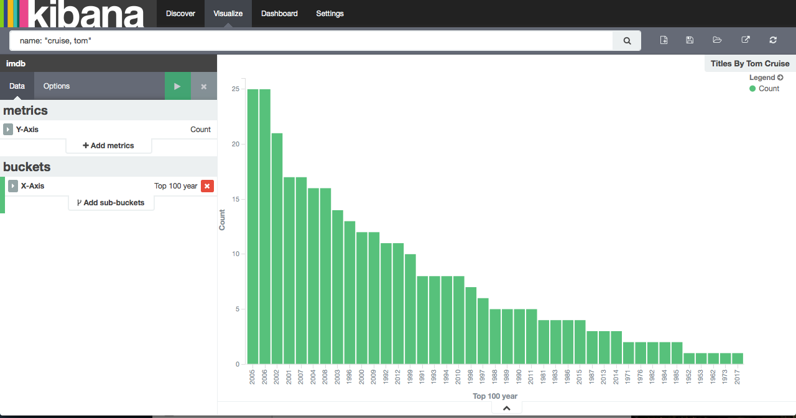

# IMDB dataset on ElasticSearch

For this assignment, I have used IMDB data from imdb dataset interface available on (ftp://ftp.sunet.se/pub/tv+movies/imdb/). Following data sets have been pre-processed and indexed on ElasticSearch database

- Actors list
- Actresses list
- Movies ratings list
 
 
 These files are in different formats so the script first pre-processes the file by parsing and cleaning the data and then uses ElasticSearch python API to bulk index data for every 1000 records. To query the data, I have used following front-ends
 
 - **ElasticSearch Data Browser:** The Web front-end over ElasticSearch data written in ExtJS
 - **Kibana:** A browser based analytics and search interface for Elasticsearch 

# ElasticSearch

ElasticSearch can be accessed at [elasticsearch URL](http://198.23.88.19:9200/)

## Kibana - Front End

Kibana front end for ElasticSearch can be accessed at [Kibana Discover URL](http://198.23.88.19:5601/#/discover)

## ElasticSearch Data Browser - Front End

ElasticSearch Data browser can be accessed at [URL](http://198.23.88.19:9200/_plugin/browser/)

To query actors/actresses go to [actors browser URL](http://198.23.88.19:9200/_plugin/browser/?database=imdb&table=actors)

To query movie ratings go to [ratings browser URL](http://198.23.88.19:9200/_plugin/browser/?database=imdb&table=ratings)

# Top-5 interesting queries

### 1. Movies in Last 5 Years by Ratings

This query shows number of movies last 5 years based on top-5 ratings [URL](http://198.23.88.19:5601/#/visualize/edit/Movies-in-last-5-years-split-by-Top-5-ratings?_g=%28%29&_a=%28filters:!%28%29,linked:!f,query:%28query_string:%28analyze_wildcard:!t,query:%27year:%201900%20TO%202014%27%29%29,vis:%28aggs:!%28%28id:%271%27,params:%28%29,schema:metric,type:count%29,%28id:%272%27,params:%28field:year,order:desc,orderBy:%271%27,size:10%29,schema:segment,type:terms%29,%28id:%273%27,params:%28field:rating,order:desc,orderBy:%271%27,size:5%29,schema:group,type:terms%29%29,listeners:%28%29,params:%28addLegend:!t,addTimeMarker:!f,addTooltip:!t,defaultYExtents:!f,mode:stacked,scale:linear,setYExtents:!f,shareYAxis:!t,times:!%28%29,yAxis:%28%29%29,type:histogram%29%29)

### 2. Top Roles Played By Actors/Actresses in Last 5 years

This query shows top roles played by actors/actresses in last/top 5 years [URL](http://198.23.88.19:5601/#/visualize/edit/Actors-By-Roles-in-Top-5-years?_g=%28%29&_a=%28filters:!%28%29,linked:!f,query:%28query_string:%28analyze_wildcard:!t,query:%27*%27%29%29,vis:%28aggs:!%28%28id:%271%27,params:%28%29,schema:metric,type:count%29,%28id:%272%27,params:%28field:year,order:desc,orderBy:%271%27,size:5%29,schema:segment,type:terms%29,%28id:%273%27,params:%28field:role,order:desc,orderBy:%271%27,size:5%29,schema:segment,type:terms%29%29,listeners:%28%29,params:%28addLegend:!t,addTooltip:!t,isDonut:!f,shareYAxis:!t%29,type:pie%29%29)

### 3. Titles Between 1900 and 2014

This query shows total movies/titles (including TV series) produced and released between 1900 and 2014 [URL](http://198.23.88.19:5601/#/visualize/edit/Movies-Between-1900-and-2014?_g=%28%29&_a=%28filters:!%28%29,linked:!f,query:%28query_string:%28analyze_wildcard:!t,query:%27ratings.year:%20[1900%20TO%202014]%27%29%29,vis:%28aggs:!%28%28id:%271%27,params:%28%29,schema:metric,type:count%29,%28id:%272%27,params:%28field:year,order:desc,orderBy:%271%27,size:120%29,schema:segment,type:terms%29%29,listeners:%28%29,params:%28addLegend:!t,addTimeMarker:!f,addTooltip:!t,defaultYExtents:!f,mode:stacked,scale:linear,setYExtents:!f,shareYAxis:!t,times:!%28%29,yAxis:%28%29%29,type:histogram%29%29)

### 4. Titles with Greater Than 8.0 Rating

This query shows total movies with greater than 8 rating [URL](http://198.23.88.19:5601/#/visualize/edit/Titles-with-Greater-Than-8.0-Rating?_g=%28%29&_a=%28filters:!%28%29,linked:!f,query:%28query_string:%28analyze_wildcard:!t,query:%27ratings.rating:%208%20OR%20ratings.rating:%209%20OR%20ratings.rating:%2010%27%29%29,vis:%28aggs:!%28%28id:%271%27,params:%28%29,schema:metric,type:count%29,%28id:%272%27,params:%28field:rating,order:desc,orderBy:%271%27,size:5%29,schema:group,type:terms%29,%28id:%273%27,params:%28field:year,order:desc,orderBy:%271%27,size:5%29,schema:segment,type:terms%29%29,listeners:%28%29,params:%28addLegend:!t,addTimeMarker:!f,addTooltip:!t,defaultYExtents:!f,mode:stacked,scale:linear,setYExtents:!f,shareYAxis:!t,times:!%28%29,yAxis:%28%29%29,type:histogram%29%29)

### 5. Titles Acted By Tom Cruise

This query shows number of titles acted by Tom Cruise in his career in all languages [URL](http://198.23.88.19:5601/#/visualize/create?_a=%28filters:!%28%29,linked:!f,query:%28query_string:%28analyze_wildcard:!t,query:%27name:%20%22cruise,%20tom%22%27%29%29,vis:%28aggs:!%28%28id:%271%27,params:%28%29,schema:metric,type:count%29,%28id:%272%27,params:%28field:year,order:desc,orderBy:%271%27,size:100%29,schema:segment,type:terms%29%29,listeners:%28%29,params:%28addLegend:!t,addTimeMarker:!f,addTooltip:!t,defaultYExtents:!f,mode:stacked,scale:linear,setYExtents:!f,shareYAxis:!t,times:!%28%29,yAxis:%28%29%29,type:histogram%29%29&indexPattern=imdb&type=histogram&_g=%28%29)

